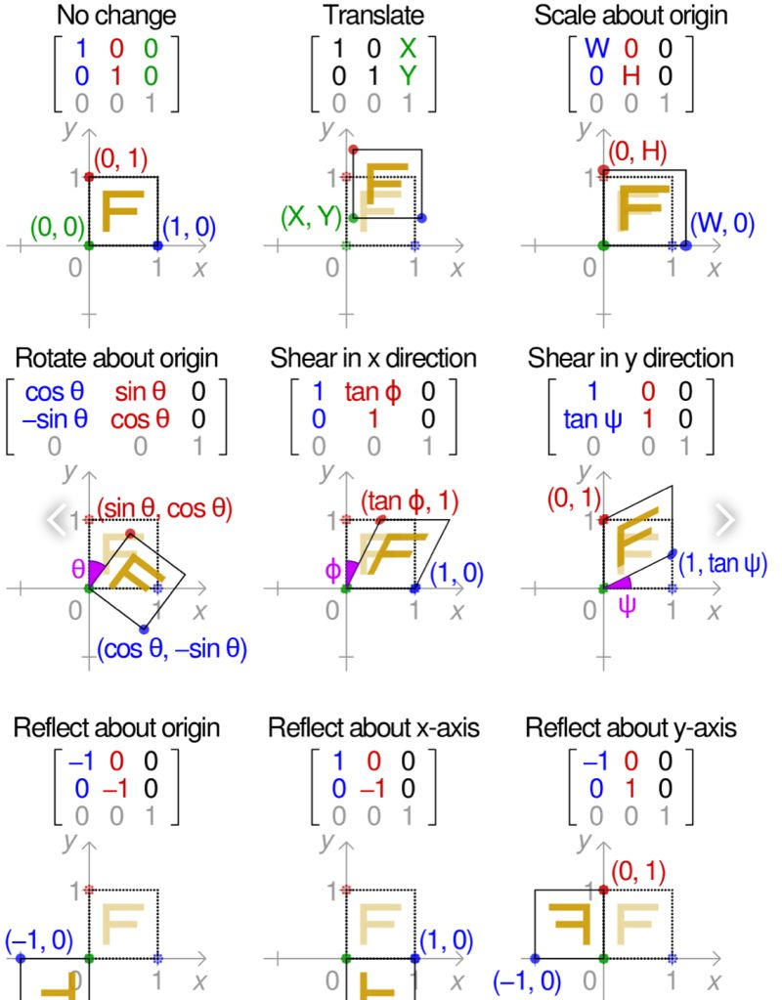

# 2DAffineTransforms
In Euclidean geometry, an affine transformation, or an affinity, is a geometric transformation that preserves lines and parallelism.Affine transformations are very useful in Data augmentation.

